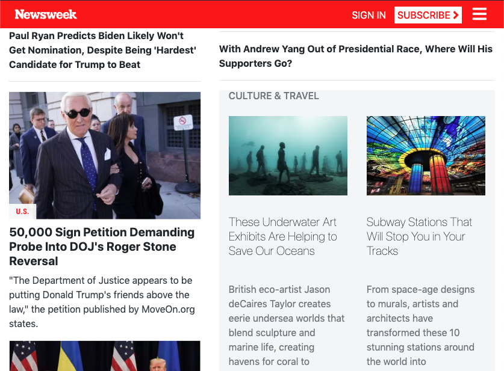

# Using-Bootstrap (The News Week Hompage Clone)

> This project is based on a replica of the news site home page of Newsweek.com using the Bootstrap framework.

> You can find the original project specification at: https://www.theodinproject.com/courses/html5-and-css3/lessons/using-bootstrap

**Desktop**

**Tablet**

**Mobile**

## Built With

- Bootstrap
- Box Model
- FlexBox
- Media Queries

## Live Demo

[Live Demo Link](https://rawcdn.githack.com/Elbie-em/Using-Bootstrap-The-News-Week-Hompage-Clone-/a1fd069352abf89579ef2b8f4c1cc0ceda6790b3/index.html)

## Getting Started

**This is a static page and was made using  CSS & HTML, you don't need .**
**anything to start up this page, is already published in a public repository so you can check the final result. For a better understanding of the code read about FlexBox,Grid, Media Queries and Floats.**

## Author

👤 **Elbie Moonga**

- GitHub: [@Elbie-Em](https://github.com/Elbie-em)
- Twitter: [ElbieEm](https://twitter.com/ElbieEm)
- LinkedIn: [elbie-moonga](https://www.linkedin.com/in/elbie-moonga-253bbb12b/)

## 🤝 Contributing

Contributions, issues and feature requests are welcome!

Feel free to check this link --> [here](https://github.com/Elbie-em/Using-Bootstrap-The-News-Week-Hompage-Clone-/issues) for issues.

## Show your support

Give a ⭐️ if you like this project!

## 📝 License

This project is [MIT](lic.url) licensed.
